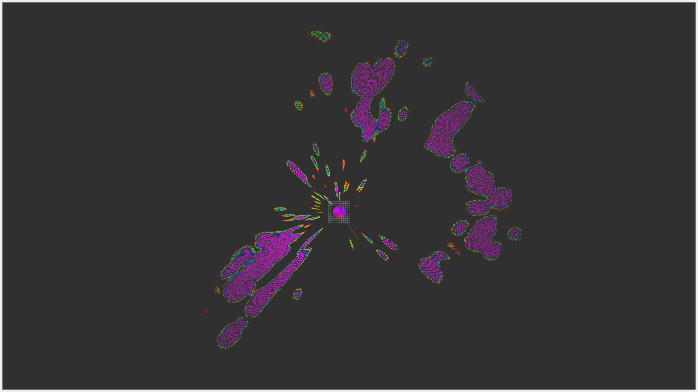
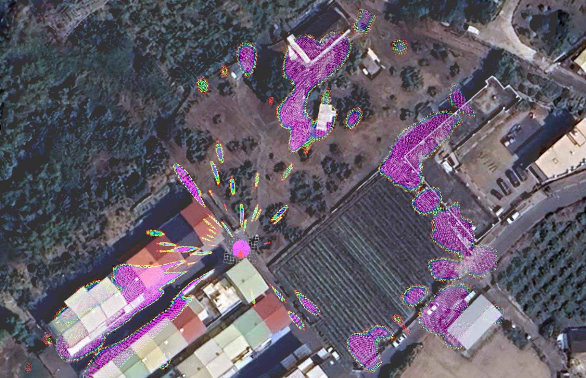

# simrad_halo20_radar

The `simrad_halo20_radar` package provides ROS2 support for the Simrad Halo20 radar. This package is being developed in ROS2 Humble.
It includes four packages:

- `halo_radar`: Provides core functionalities for interfacing with the Halo radar hardware.
- `halo_radar_visualize`: Contains QT-GUI tools for configuring radar settings and visualizing radar data.
- `marine_sensor_msgs`: Defines marine message types used for marine applications.
- `marine_radar_control_msgs`: Contains message definitions for controlling marine radar systems.

## Installation

### Building from Source

#### Dependencies

- [Robot Operating System (ROS) 2](http://docs.ros.org/en/humble/) (middleware for robotics),

#### Clone the repository

```bash
cd ros2_workspace/src
git clone git@github.com:JetSeaAI/simrad_halo20_radar.git
```

#### Building

```bash
rosdep install --from-paths src --ignore-src -r -y
colcon build --symlink-install
```

## Node

The 'halo_radar' package provides a C++ node. This node handles the communication with the radar device and publishes the radar data to the relevant topics.

```bash
ros2 run halo_radar halo_radar
```

The 'halo_radar_visualize' package provides two python node.

- `halo_radar_control_panel`: Provides a QT-GUI for configuring the radar and starting/stopping the radar.

```bash
ros2 run halo_radar_visualize halo_radar_control_panel
```

- `halo_radar_visualize`: This node uses the radar message data from `halo_radar` to generate the point cloud for visualization.

```bash
ros2 run halo_radar_visualize halo_radar_visualize
```

## Launch File

The `halo_radar_visualize` package includes a launch file `bringup_halo_radar.launch.py` which can be used to start the radar node, control panel and visualize node.

```bash
ros2 launch halo_radar_visualize bringup_halo_radar.launch.py
```

## Parameters

The following parameters can be set in the `halo_radar_control_panel`:

| Parameter                | Description                                                                 | Values                                                                                  |
|--------------------------|-----------------------------------------------------------------------------|-----------------------------------------------------------------------------------------|
| `status`                 | Radar status, can be set to `transmit` or `standby`.                        | `transmit`, `standby`                                                                   |
| `range`                  | Radar range in meters.                                                      | `50`, `1/32` (57), `75`, `100`, `1/16` (115), `1/8 NM` (231), `1/4 NM` (463), `1/2 NM` (926), `3/4 NM` (1389), `1 NM` (1852), `1.5 NM` (2778), `2 NM` (3704), `3 NM` (5556), `4 NM` (7408), `6 NM` (11112), `8 NM` (14816), `12 NM` (22224), `16 NM` (29632), `24 NM` (44448) |
| `gain`                   | Gain value, range from 0 to 100.                                            | `0` to `100`                                                                            |
| `mode`                   | Radar mode.                                                                 | `custom`, `harbor`, `offshore`, `weather`, `bird`                                       |
| `sea_clutter`            | Sea clutter, range from 0 to 100.                                           | `0` to `100`                                                                            |
| `auto_sea_clutter_nudge` | Auto sea clutter nudge, range from -50 to 50.                               | `-50` to `50`                                                                           |
| `sea_state`              | Sea state.                                                                  | `calm`, `moderate`, `rough`                                                             |
| `rain_clutter`           | Rain clutter, range from 0 to 100.                                          | `0` to `100`                                                                            |
| `noise_rejection`        | Noise rejection.                                                            | `off`, `low`, `medium`, `high`                                                          |
| `target_expansion`       | Target expansion.                                                           | `off`, `low`, `medium`, `high`                                                          |
| `interference_rejection` | Interference rejection.                                                     | `off`, `low`, `medium`, `high`                                                          |
| `target_separation`      | Target separation.                                                          | `off`, `low`, `medium`, `high`                                                          |
| `scan_speed`             | Scan speed.                                                                 | `off`, `medium`, `high`                                                                 |
| `doppler_mode`           | Doppler mode.                                                               | `off`, `normal`, `approaching_only`                                                     |
| `doppler_speed`          | Doppler speed threshold, range from 0.05 to 15.95.                          | `0.05` to `15.95`                                                                       |
| `antenna_height`         | Antenna height, range from 0 to 30 meters.                                  | `0` to `30` meters                                                                      |
| `bearing_alignment`      | Bearing alignment, range from 0.0 to 360.0 degrees.                         | `0.0` to `360.0` degrees                                                                |
| `sidelobe_suppression`   | Sidelobe suppression, range from 0 to 100.                                  | `0` to `100`                                                                            |
| `lights`                 | Radar lights.                                                               | `off`, `low`, `medium`, `high`                                                          |

These parameters can be set through the graphical interface of the `halo_radar_control_panel` and will be automatically published to the `/HaloA/change_state` topic.

## GUI for setting parameters

The `halo_radar_control_panel` provides a user-friendly graphical interface for setting radar parameters. This GUI allows users to easily configure and adjust radar settings such as range, gain, sea clutter, and more. Below is an example of the GUI:


## Topics

The `halo_radar` node publishes and subscribes to the following topics:

### `halo_radar` Published Topics

- `<label>/data`: Publishes radar sector data, message type `marine_sensor_msgs::msg::RadarSector`.
- `<label>/state`: Publishes radar control settings data, message type `marine_radar_control_msgs::msg::RadarControlSet`.

### `halo_radar` Subscribed Topics

- `<label>/change_state`: Subscribes to radar control value changes, message type `marine_radar_control_msgs::msg::RadarControlValue`.

The `<label>` in these topics is dynamically generated based on the radar device's label. For example, if the radar device's label is `HaloA`, the actual topic names will be `HaloA/data`, `HaloA/state`, and `HaloA/change_state`.

The `halo_radar_visualize` node publishes and subscribes to the following topics:

### `halo_radar_visualize` Subscribed Topics

- `/HaloA/data`: Subscribes to radar sector data, message type `marine_sensor_msgs::msg::RadarSector`.

### `halo_radar_visualize` Published Topics

- `/radar_image`: Publishes radar image data, message type `sensor_msgs::msg::Image`. # Deprecated: Use `/radar_pointcloud` for more detailed and accurate radar data representation.
- `/radar_pointcloud`: Publishes radar point cloud data, message type `sensor_msgs::msg::PointCloud2`.

## Special Message

The package defines a special message type `RadarSector` which includes the following fields:

| Field                | Type                        | Description                                                                 |
|----------------------|-----------------------------|-----------------------------------------------------------------------------|
| `header`             | std_msgs/Header             | Standard ROS2 message header.                                               |
| `angle_start`        | float32                     | Start angle of this sector in radians.                                      |
| `angle_increment`    | float32                     | Angular distance between rays in radians.                                   |
| `time_increment`     | builtin_interfaces/Duration | Time between rays in seconds.                                               |
| `scan_time`          | builtin_interfaces/Duration | Time between two consecutive complete scans or revolutions in seconds.      |
| `range_min`          | float32                     | Range of the first sample in each ray in meters.                            |
| `range_max`          | float32                     | Range of the last sample in each ray in meters.                             |
| `intensities`        | RadarEcho[]                 | Intensity data in device-specific units.                                    |

### Example `RadarSector` Message

```plaintext
header:
  stamp:
    sec: 1731824462
    nanosec: 518810473
  frame_id: radar
angle_start: 2.3746023178100586
angle_increment: -0.0030679635237902403
time_increment:
  sec: 0
  nanosec: 1176373
scan_time:
  sec: 2
  nanosec: 607983325
range_min: 0.0
range_max: 86.0
intensities: '<sequence type: marine_sensor_msgs/msg/RadarEcho, length: 32>'
```

## Scan Results Comparison

| ROS2 Package Result | OpenCPN Scan Result |
|---------------------|---------------------------------|
|  |  |

- These two images show the ROS2 package and the OpenCPN scan result settings.
- Although there are little differences, it is evident that the shadow and echo are almost the same.

## Radar scan Result Overlayer with satellite image

| The environment while scanning |
|------------------|
|  |

| The radar scan result overlayer on satellite image |
|------------------|
|  |
